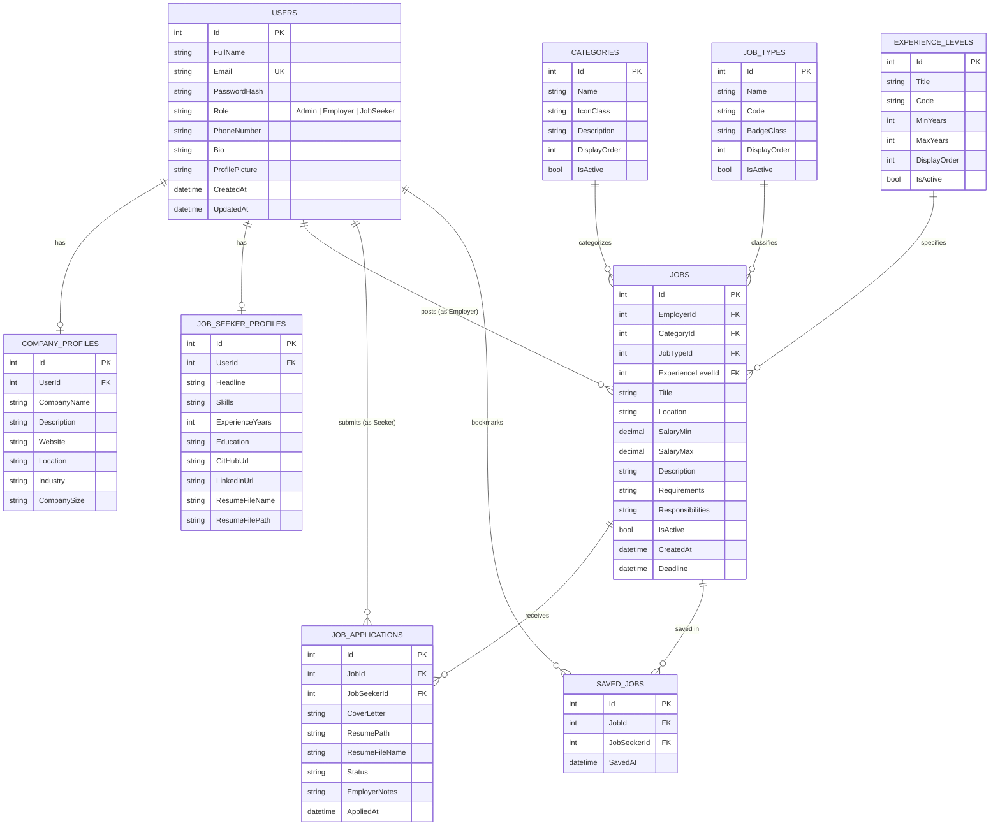

# 💼 JobPortPro - Enterprise Job Portal Web Application

[](https://github.com/pra2011shant/JobPortPro/actions/workflows/build-and-deploy.yml)


**JobPortPro** is an enterprise-grade recruitment and career management platform built with **ASP.NET Core MVC (.NET 8)**, **Microsoft SQL Server**, **100% Stored Procedures Execution Engine**, **Bootstrap 5.3**, and **SweetAlert2**. It provides an end-to-end recruitment lifecycle connecting **Job Seekers**, **Employers**, and **System Administrators** with high performance and top-tier security.

---

## 📑 Table of Contents

- [Architecture Overview](#-architecture-overview)
- [Key Features & Modules](#-key-features--modules)
  - [1. Job Seekers & Candidate Portal](#1-job-seekers--candidate-portal)
  - [2. Employers & Applicant Tracking System (ATS)](#2-employers--applicant-tracking-system-ats)
  - [3. Admin Control Center](#3-admin-control-center)
  - [4. Security, Auth & SweetAlert2 UX](#4-security-auth--sweetalert2-ux)
- [Database Schema & ER Diagram](#-database-schema--er-diagram)
- [Stored Procedures Engine](#-stored-procedures-engine)
- [REST API Endpoints](#-rest-api-endpoints)
- [Technology Stack](#-technology-stack)
- [Getting Started & Installation](#-getting-started--installation)
- [CI/CD Workflow](#-cicd-workflow)
- [License](#-license)

---

## 🏛️ Architecture Overview

The application is engineered using clean OOP principles, repository patterns, and a 100% parameterized SQL Stored Procedure execution layer:

```
JobPortPro/
├── .github/
│   └── workflows/
│       └── build-and-deploy.yml    # Automated CI/CD GitHub Actions Workflow
├── Controllers/
│   ├── Api/
│   │   └── JobsApiController.cs   # RESTful JSON endpoints for external integrations
│   ├── AccountController.cs       # Authentication, registration, profile & password recovery
│   ├── AdminController.cs         # Administrative dashboard, user & job moderation
│   ├── EmployerController.cs      # Job postings, ATS recruitment funnel & candidate dossiers
│   ├── HomeController.cs          # Public landing page, category exploration & stats
│   ├── JobSeekerController.cs     # Seeker dashboard, applications, bookmarks & resume builder
│   └── JobsController.cs          # Job search, multi-filter & application submission
├── Data/
│   ├── Scripts/
│   │   └── StoredProcedures.sql   # 19 Self-healing SQL Server Stored Procedures
│   ├── ApplicationDbContext.cs    # EF Core relational schema mapping
│   └── DbInitializer.cs           # Database schema check & SPs auto-migration engine
├── Models/
│   ├── User.cs                    # User entity with Role-Based Access Control (RBAC)
│   ├── Job.cs                     # Job listing entity with salary, type & experience
│   ├── JobApplication.cs          # Candidate submission & ATS progression
│   ├── JobType.cs                 # Master job types (Full-Time, Remote, Contract, etc.)
│   ├── ExperienceLevel.cs         # Master experience levels (Entry, Mid, Senior, Director)
│   ├── Category.cs                # Industry categories with FontAwesome icons
│   ├── CompanyProfile.cs          # Employer organization branding
│   ├── JobSeekerProfile.cs        # Candidate resume, headline & portfolio links
│   ├── SavedJob.cs                # Bookmarked jobs
│   └── ViewModels.cs              # Strongly typed view models
├── Services/
│   ├── IStoredProcedureExecutor.cs# ADO.NET SQL parameter executor interface
│   ├── StoredProcedureExecutor.cs # Injection-proof Stored Procedure engine
│   ├── IAuthService.cs / AuthService.cs
│   ├── IJobService.cs / JobService.cs
│   ├── IApplicationService.cs / ApplicationService.cs
│   └── ILookupService.cs / LookupService.cs
├── Views/                         # Modern Razor views with Bootstrap 5 & SweetAlert2
├── wwwroot/                       # Static assets (site.css, site.js, uploads, icons)
├── Program.cs                     # Middleware pipeline & Dependency Injection (DI)
└── web.config                     # Production IIS reverse proxy configuration
```

---

## 🌟 Key Features & Modules

### 1. Job Seekers & Candidate Portal
- **Advanced Multi-Parameter Job Search**:
  - Full-text keyword search across titles, descriptions, skills, and company names.
  - Filter by Category, Job Type (*Full-Time*, *Remote*, *Part-Time*, *Contract*, *Internship*), Experience Level, Location, and Minimum Salary.
  - Sort by *Newest*, *Salary: High to Low*, or *Salary: Low to High*.
- **Interactive Resume Builder**:
  - Live dynamic preview as you type with instant formatting.
  - Generates polished, ATS-ready resumes with 1-click Browser Print & PDF Export.
- **AI Profile Skill Match Indicator**:
  - Calculates job suitability match scores (*e.g., 88% Strong Match*) against job requirements.
- **Quick Apply & Dedicated Apply Modes**:
  - Modal-based or standalone application submission with custom pitch letters and PDF/DOCX resumes.
- **Application Status Tracking**:
  - Real-time progression (*Pending* ➔ *Reviewed* ➔ *Shortlisted* ➔ *Accepted* / *Rejected*) with employer feedback.
- **Job Bookmarks**: Save positions to review and apply anytime.

---

### 2. Employers & Applicant Tracking System (ATS)
- **Recruitment Dashboard & Funnel Analytics**:
  - Metrics on active listings, applicant pipeline volume, shortlisted candidates, and conversion rates.
- **Job Postings Management**:
  - Create, edit, pause/activate, or delete job postings with rich descriptions and deadlines.
- **Applicant Dossier Review**:
  - Comprehensive candidate profiles with education, experience, skill badges, portfolio links, and 1-click resume downloads.
  - Update candidate status in the recruitment funnel with private hiring notes.
- **Company Branding Profile**:
  - Set company name, HQ location, industry, team size, website, and mission statement.

---

### 3. Admin Control Center
- **System Overview & Metrics**: Platform-wide statistics on total users, job seekers, employers, active postings, and total applications.
- **User Moderation**: Filter, inspect, and manage user accounts across all roles.
- **Job Moderation**: Review and moderate all platform listings with status toggling and deletion capabilities.

---

### 4. Security, Auth & SweetAlert2 UX
- **SweetAlert2 Toast & Modal Engine**:
  - Automatic toast alerts for flash messages (*Success, Error, Warning, Info*).
  - Animated, double-confirmation popups for all destructive actions (*Delete Job, Delete User, Withdraw Application, Remove Bookmark*).
- **Password Visibility Toggles**: Interactive show/hide eye toggles on all password fields.
- **Forgot & Reset Password Workflow**: Secure email verification and BCrypt password reset.
- **Single Account per Email Enforcement**: Uniqueness validation at both UI and SQL Stored Procedure levels.
- **Zero Hardcoded Credentials**: Pure dynamic registration and authentication via SQL Server.

---

## 🗄️ Database Schema & ER Diagram

The database consists of **9 normalized relational tables** mapped with foreign key integrity:



---

## ⚡ Stored Procedures Engine

All primary database operations run through **19 parameterized SQL Server Stored Procedures** located in [`Data/Scripts/StoredProcedures.sql`](file:///Data/Scripts/StoredProcedures.sql):

| Stored Procedure | Purpose |
|---|---|
| `dbo.sp_CreateUser` | Registers new user with duplicate check & returns generated ID |
| `dbo.sp_GetUserByEmail` | Authenticates user & joins company/seeker profile data |
| `dbo.sp_UpdateUserPassword` | Securely updates password hash for password reset |
| `dbo.sp_GetFilteredJobs` | Multi-parameter search, dynamic filtering & pagination |
| `dbo.sp_GetJobById` | Fetches complete job details with relations |
| `dbo.sp_CreateJob` | Inserts new job listing |
| `dbo.sp_UpdateJob` | Updates existing job listing details |
| `dbo.sp_DeleteJob` | Deletes job and associated application cascades |
| `dbo.sp_ToggleJobStatus` | Toggles listing status between Active and Closed |
| `dbo.sp_GetCategories` | Returns active categories with job count metrics |
| `dbo.sp_GetJobTypes` | Fetches master job types |
| `dbo.sp_GetExperienceLevels`| Fetches master experience levels |
| `dbo.sp_SubmitJobApplication`| Submits candidate job application |
| `dbo.sp_GetApplicationsByJobId`| Retrieves candidates for an employer's job posting |
| `dbo.sp_GetApplicationsBySeekerId`| Retrieves a candidate's application history |
| `dbo.sp_UpdateApplicationStatus`| Updates ATS progression status & recruiter notes |
| `dbo.sp_WithdrawApplication`| Withdraws candidate application |
| `dbo.sp_ToggleSavedJob` | Bookmarks or un-bookmarks a job posting |
| `dbo.sp_GetSavedJobsBySeekerId`| Fetches bookmarked jobs for candidate |

---

## 🔌 REST API Endpoints

| Method | Endpoint | Description |
|---|---|---|
| `GET` | `/api/jobsapi` | Paginated JSON list of active jobs with filters (`q`, `categoryId`, `jobType`, `location`, `minSalary`, `sortBy`, `page`) |
| `GET` | `/api/jobsapi/{id}` | Single job details with employer information |
| `GET` | `/api/jobsapi/categories` | Industry categories with active job counts |

---

## 🛠️ Technology Stack

- **Backend Framework**: ASP.NET Core MVC (.NET 8.0)
- **Programming Language**: C# 12
- **Database**: Microsoft SQL Server Express / Developer / Azure SQL
- **Data Access**: ADO.NET Parameterized Stored Procedures & Entity Framework Core 8.0
- **Authentication & Cryptography**: Cookie Authentication & BCrypt.Net-Next (Salted Hashing)
- **Frontend & Styling**: Razor Views, Bootstrap 5.3.3, Vanilla CSS Design System, FontAwesome 6
- **Popups & Alerts**: SweetAlert2 v11
- **CI/CD Automation**: GitHub Actions (`build-and-deploy.yml`)

---

## 🚀 Getting Started & Installation

### 1. Prerequisites
- [.NET 8.0 SDK](https://dotnet.microsoft.com/download/dotnet/8.0)
- Microsoft SQL Server (Local, Express, or Azure SQL)
- Visual Studio 2022 / VS Code / Antigravity IDE

### 2. Clone the Repository
```bash
git clone https://github.com/pra2011shant/JobPortPro.git
cd JobPortPro
```

### 3. Configure Database Connection
Set your SQL Server connection string in `appsettings.json`:
```json
{
  "ConnectionStrings": {
    "DefaultConnection": "Server=DESKTOP-MMR6QJM\\SQLEXPRESS;Database=JobPortPro;Trusted_Connection=True;MultipleActiveResultSets=true;TrustServerCertificate=True;"
  }
}
```

### 4. Build and Run
```bash
dotnet build
dotnet run
```
Open **`https://localhost:7169`** (or `http://localhost:5246`) in your browser.

---

## 🔄 CI/CD Workflow

The repository includes an automated GitHub Actions pipeline in [`.github/workflows/build-and-deploy.yml`](file:///.github/workflows/build-and-deploy.yml):

- **Triggers**: On every `push` and `pull_request` targeting `main`.
- **Pipeline Stages**:
  1. Checks out source code.
  2. Sets up .NET 8 SDK.
  3. Restores NuGet packages with caching.
  4. Builds project in `Release` mode.
  5. Publishes deployable production bundle as a GitHub Actions artifact.

---

## 📄 License

This project is open-source and licensed under the **MIT License**.
