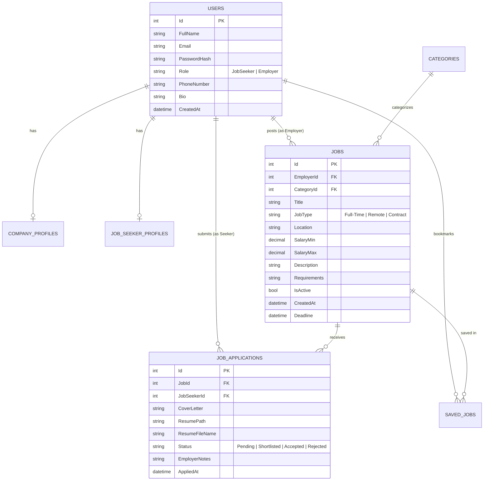

# 💼 JobPortPro - Enterprise Job Portal Web Application

[](https://github.com/pra2011shant/JobPortPro/actions/workflows/build-and-deploy.yml)


**JobPortPro** is a modern, production-grade full-featured Job Portal web application built using **ASP.NET Core MVC (.NET 8)**, **Entity Framework Core**, **Microsoft SQL Server**, and **Bootstrap 5**. It provides a seamless recruitment pipeline connecting ambitious **Job Seekers** with top **Employers** and hiring managers worldwide.

---

## 📑 Table of Contents

- [Architecture Overview](#-architecture-overview)
- [Key Features](#-key-features)
  - [For Job Seekers](#-for-job-seekers)
  - [For Employers](#-for-employers)
  - [General & UI/UX](#-general--uiux)
- [Technology Stack](#-technology-stack)
- [Database Schema & Models](#-database-schema--models)
- [REST API Endpoints](#-rest-api-endpoints)
- [Getting Started & Installation](#-getting-started--installation)
- [Demo Credentials](#-demo-credentials)
- [CI/CD Workflow](#-cicd-workflow)
- [Security & Deployment](#-security--deployment)

---

## 🏛️ Architecture Overview

The project adheres strictly to the **Model-View-Controller (MVC)** architectural pattern combined with a decoupled **Service / Repository Layer** to enforce separation of concerns, testability, and clean code principles:

```
JobPortPro/
├── .github/
│   └── workflows/
│       └── build-and-deploy.yml    # CI/CD Automated Build & Artifact Pipeline
├── Controllers/
│   ├── Api/
│   │   └── JobsApiController.cs   # RESTful JSON endpoints for Postman & mobile apps
│   ├── AccountController.cs       # Authentication, registration & profile logic
│   ├── EmployerController.cs      # Employer dashboard, job management & ATS
│   ├── HomeController.cs          # Public landing page, stats & contact
│   ├── JobSeekerController.cs     # Candidate portal, applied jobs & bookmarks
│   └── JobsController.cs          # Job search, multi-filter & application flow
├── Data/
│   ├── ApplicationDbContext.cs    # EF Core database context & relational mapping
│   └── DbInitializer.cs           # Database auto-creation & rich sample data seeder
├── Models/
│   ├── User.cs                    # User entity with RBAC support
│   ├── Job.cs                     # Job listing entity
│   ├── JobApplication.cs          # Candidate application & recruiter feedback
│   ├── Category.cs                # Industry categories
│   ├── CompanyProfile.cs          # Employer organization profile
│   ├── JobSeekerProfile.cs        # Candidate resume & skill profile
│   ├── SavedJob.cs                # Bookmarked jobs
│   └── ViewModels.cs              # Strongly typed view models
├── Services/
│   ├── IAuthService.cs            # Authentication business logic interface
│   ├── AuthService.cs             # Registration, BCrypt hash verification & profile
│   ├── IJobService.cs             # Job CRUD & advanced filtering interface
│   ├── JobService.cs              # Parameterized EF Core LINQ queries
│   ├── IApplicationService.cs     # Application lifecycle interface
│   └── ApplicationService.cs      # Status transitions & candidate dossiers
├── Views/                         # Razor views with Bootstrap 5
├── wwwroot/                       # Static assets (CSS, JS, Resumes, Favicon)
├── Program.cs                     # Middleware pipeline & Dependency Injection (DI)
└── web.config                     # Production IIS reverse proxy configuration
```

---

## 🌟 Key Features

### 👨‍💻 For Job Seekers
- **Multi-Parameter Job Search**:
  - Full-text keyword search across job title, description, skills, and company name.
  - Filter by industry category, job type (*Full-Time*, *Remote*, *Part-Time*, *Contract*, *Internship*), location, and minimum annual salary.
  - Sort by *Newest First*, *Salary High to Low*, or *Salary Low to High*.
- **Quick Apply & Dedicated Apply Modes**: Apply instantly via a modern inline **Bootstrap Modal** or on the dedicated application page.
- **Resume Management**: Choose between submitting saved profile resumes or uploading position-tailored files (PDF/DOCX).
- **Live Application Tracking**: Monitor application progression in real time (*Pending*, *Reviewed*, *Shortlisted for Interview*, *Hired / Accepted*, *Rejected*) and read personalized feedback from recruiters.
- **Job Bookmarks**: Save positions with one click to apply later.
- **Candidate Profile**: Showcase professional headline, skills tags, years of experience, education, GitHub, and LinkedIn links.

---

### 🏢 For Employers
- **Employer Analytics Dashboard**: Real-time metrics on total jobs posted, active listings, candidate applications received, and shortlisted talent.
- **Job Postings Management**: Create detailed listings with annual salary ranges, responsibilities, requirements, and closing deadlines. Activate, close, edit, or delete listings with one click.
- **Applicant Tracking System (ATS)**:
  - Filter candidate submissions per job posting or review company-wide applications.
  - Review applicant dossiers, pitch letters, and direct-download PDF/DOCX resumes.
  - Move candidates through hiring stages (*Pending* ➔ *Reviewed* ➔ *Shortlisted* ➔ *Accepted* / *Rejected*).
  - Add internal recruiter notes and interview instructions.
- **Company Branding Profile**: Customize company logo, description, headquarters location, website, industry, and team size.

---

### 🎨 General & UI/UX
- **Dynamic Master Layout** with role-aware navigation bar.
- **Mobile-Responsive Design** with collapsible offcanvas filter drawer on mobile screens.
- **One-Click Demo Credentials** for instant trial on the login page.
- **Toast Notifications** for instant user feedback.

---

## 🛠️ Technology Stack

| Layer | Technology |
|---|---|
| **Framework** | ASP.NET Core MVC (.NET 8.0) |
| **Language** | C# 12 |
| **Database** | Microsoft SQL Server (Express / Developer / Enterprise / Azure SQL) |
| **ORM** | Entity Framework Core 8.0 (Code-First) |
| **Security** | ASP.NET Core Cookie Authentication & BCrypt.Net-Next (Salted Hashing) |
| **Frontend** | Razor View Engine, Bootstrap 5.3.3, FontAwesome 6 Icons |
| **Typography** | Google Fonts (*Plus Jakarta Sans* & *Inter*) |
| **CI/CD** | GitHub Actions (`build-and-deploy.yml`) |
| **Web Server** | Kestrel & IIS (`AspNetCoreModuleV2`) |

---

## 🗄️ Database Schema & Models



---

## 🔌 REST API Endpoints

In addition to full MVC HTML views, **JobPortPro** exposes RESTful JSON endpoints for Postman, mobile integrations, and headless clients:

| Method | Endpoint | Description | Query Parameters |
|---|---|---|---|
| `GET` | `/api/jobsapi` | Returns paginated list of active jobs | `q`, `categoryId`, `jobType`, `location`, `minSalary`, `sortBy`, `page` |
| `GET` | `/api/jobsapi/{id}` | Returns single job details with company bio | None |
| `GET` | `/api/jobsapi/categories` | Returns all categories with active job counts | None |

---

## 🚀 Getting Started & Installation

### 1. Prerequisites
- [.NET 8.0 SDK](https://dotnet.microsoft.com/download/dotnet/8.0)
- Microsoft SQL Server (e.g. `DESKTOP-MMR6QJM\SQLEXPRESS` or `(localdb)\mssqllocaldb`)
- Visual Studio 2022 / VS Code / Antigravity IDE

### 2. Clone the Repository
```bash
git clone https://github.com/pra2011shant/JobPortPro.git
cd JobPortPro
```

### 3. Configure SQL Server Connection
Open `appsettings.json` and adjust the connection string to match your SQL Server instance:
```json
{
  "ConnectionStrings": {
    "DefaultConnection": "Server=DESKTOP-MMR6QJM\\SQLEXPRESS;Database=JobPortPro;Trusted_Connection=True;MultipleActiveResultSets=true;TrustServerCertificate=True;"
  }
}
```

### 4. Build and Run
The database and rich demo data will automatically initialize and seed on the first run:
```bash
dotnet build
dotnet run
```
Open your browser and navigate to: **`http://localhost:5246`**

---

## 🔑 Demo Credentials

Pre-seeded accounts available for instant testing:

| Role | Email | Password | Access / Description |
|---|---|---|---|
| **Employer** | `employer@techsolutions.com` | `Password123!` | TechSolutions Global - Post jobs, review candidate dossiers, update ATS pipeline status. |
| **Job Seeker** | `rahul.verma@example.com` | `Password123!` | Senior .NET Developer - Search jobs, apply with resume, view application status. |

---

## 🔄 CI/CD Workflow

The repository includes a production-ready **GitHub Actions CI/CD pipeline** located at [`.github/workflows/build-and-deploy.yml`](file:///.github/workflows/build-and-deploy.yml):

- **Triggers**: On every `push` and `pull_request` to the `main` branch.
- **Pipeline Steps**:
  1. Checks out repository code.
  2. Provisions .NET 8 SDK environment.
  3. Restores NuGet dependencies.
  4. Builds project in `Release` configuration.
  5. Publishes production artifacts and uploads the zipped deployable bundle.

---

## 🔒 Security & Deployment

For complete IIS setup, Windows Server configuration, Azure App Service deployment, and security hardening details, refer to the [Deployment Guide (DEPLOYMENT.md)](DEPLOYMENT.md).

---

## 📄 License

This project is licensed under the MIT License.
